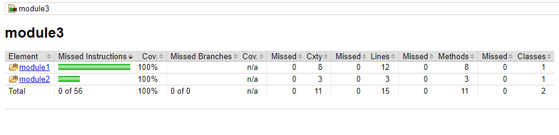

# Jacoco coverage for Multi Module Maven Project

https://sonarcloud.io/api/project_badges/measure?project=tushar393_jacoco-multi-module-sample&metric=coverage

## Overview
>A sample multi-modular maven project demonstrating how to met coverage for unit, integration and/or functional testing withing different modules.
>The test results is aggregated by Jacoco plugin and a merged code coverage report is being generated.
>The detailed blog and instructions of the project is described in [blog]().

## Run Command

>Jacoco data file location - baseDir / module3 / target / aggregate.exec

>Jacoco report location - baseDir / module3 / target / site / jacoco-aggregate / index.html

- Unit testing + jacoco reporting. 
_Note: Set a lower Coverage ratio in pom.xml_

`$ mvn clean install`

- Integration testing + jacoco reporting.
_Note: Set a lower Coverage ratio in pom.xml_

`$ mvn clean install -P integration-test`

-Unit + Integration testing + jacoco merged reporting.

`$ mvn clean install -P testAll`
  
 _Note: You may add additional configuration for jacoco and control the behaviour. For additional configuration details visit [here.]()_  

# Result: 
The below test coverage report shows coverage for `testAll` profile. 
The other important point to consider here is we have tried to increase the coverage of module1 method `concatenation` from module3 by running cucumber tests. Cucumber tests can easily be replaced by any other functional test frameworks like Karate API Testing Framework.

